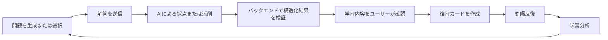

# sazare

[English](README.md) | [简体中文](README.zh-CN.md) | [日本語](README.ja.md)

> 言葉の海へ、今日もひとつ小石を

個人がローカル環境で利用するための日本語学習アプリケーションです。中国語・英語から日本語への短文／文章翻訳と、日本語文の添削に対応しています。AIによる問題生成、構造化された採点、ユーザーによる確認、間隔反復学習、学習分析を一連の学習サイクルとしてつなぎます。

## 画面イメージ

### 翻訳練習


### 採点結果


### 復習カード


### 学習分析


## 学習サイクル



AIの出力は常に未検証の候補データとして扱います。ユーザーが明示的に確認したエラー分析だけが復習サイクルに追加されます。

## 主な機能

### 翻訳と添削

- 中国語・英語から日本語への短文翻訳を、ランダム出題またはAI生成問題で練習できます。
- ジャンル、文章量、JLPTレベルを指定した、中国語・英語から日本語への文章翻訳に対応します。
- 日本語文を添削し、全文の修正版、項目別スコア、エラー候補、修正提案を提示します。
- 採点結果では、総合スコア、項目別評価、エラー分析、推奨表現、参考解答を確認できます。

### AIと問題管理

- AIプロバイダーを `mock` または Google AI に切り替えられます。
- AIによる問題生成と採点には固定されたJSONスキーマを使用し、バックエンドで厳密な検証と例外処理を行います。
- PostgreSQLの `pgvector` を使用し、同じ埋め込みモデルで生成したベクトル同士の意味的類似度を検索して、AIが生成する問題の重複を減らします。
- 短文・文章問題の作成、編集、有効化、無効化、論理削除、ページネーション、絞り込みに対応します。

### 復習と学習分析

- AIが検出したエラー候補を確認して保存できるほか、改善したい表現を手動で記録できます。
- 復習カードでは、復習履歴、派生問題の生成、論理削除、SM-2に基づく復習間隔のスケジューリングを管理できます。
- 短文、文章、日本語添削の結果を解答履歴で一元的に確認できます。
- 連続学習日数、累計学習日数、練習傾向、採点項目、カード状態、復習実績を確認できます。

## 技術スタック

| 領域 | 技術 |
| --- | --- |
| バックエンド | Java 25、Spring Boot 4.0.7、Spring MVC、MyBatis 4.0.1、Maven Wrapper |
| フロントエンド | React 19、TypeScript 5、Vite 7、Recharts 3、Oxlint |
| データ | PostgreSQL 16、pgvector 0.8.6、Redis 7 |
| ローカル開発 | Docker Compose、Windows PowerShell |
| AI | Google Gemini API |

## プロジェクト構成

```text
sazare/
├─ assets/
│  └─ readme/                  README用スクリーンショット
│     └─ en/                   英語表示のスクリーンショット
├─ backend/                    Spring Bootバックエンド
│  └─ src/main/resources/
│     ├─ db/schema.sql         データベーススキーマのベースライン
│     ├─ db/seed.sql           初期データ
│     └─ mapper/               MyBatis XMLファイル
├─ frontend/                   Reactフロントエンド
├─ docker-compose.yml          PostgreSQLとRedis
├─ README.md                   英語ドキュメント（デフォルト）
├─ README.zh-CN.md             中国語ドキュメント
└─ README.ja.md                日本語ドキュメント
```

## クイックスタート

### 必要環境

- Git
- JDK 25
- Node.js `^20.19.0` または `>=22.12.0`
- Docker Compose が利用できる Docker Desktop

### 1. リポジトリをクローン

```powershell
git clone https://github.com/simokuzure/sazare.git
```

### 2. PostgreSQL と Redis を起動

```powershell
docker compose up -d
docker compose ps
```

デフォルトのサービス：

| サービス | アドレス | Compose サービス名 |
| --- | --- | --- |
| PostgreSQL | `localhost:5432` | `postgres` |
| Redis | `localhost:6379` | `redis` |

サービスを停止するには、次のコマンドを実行します。

```powershell
docker compose down
```

### 3. データベースを初期化

新しいデータベースを初期化する場合は、リポジトリのルートで次のコマンドを順番に実行します。

```powershell
Get-Content -Raw -Encoding UTF8 .\backend\src\main\resources\db\schema.sql |
  docker compose exec -T postgres psql -U sazare_user -d sazare

Get-Content -Raw -Encoding UTF8 .\backend\src\main\resources\db\seed.sql |
  docker compose exec -T postgres psql -U sazare_user -d sazare
```

`schema.sql` は新規データベース用の完全なスキーマを定義します。`seed.sql` はデフォルトユーザー、タグ、エラー種別を登録します。

### 4. AIプロバイダーを選択

Google AI を使用する場合：

```powershell
$env:AI_PROVIDER = "google"
$env:GOOGLE_AI_API_KEY = "your API key"
```

### 5. バックエンドを起動

新しい PowerShell ウィンドウで次のコマンドを実行します。

```powershell
cd backend
.\mvnw.cmd spring-boot:run
```

- API ベース URL：`http://localhost:8080/api`
- ヘルスチェック：`http://localhost:8080/api/health`

### 6. フロントエンドを起動

新しい PowerShell ウィンドウで次のコマンドを実行します。

```powershell
cd frontend
npm.cmd install
npm.cmd run dev
```

フロントエンドは `http://localhost:5173` で利用できます。Vite は `/api` へのリクエストを `http://localhost:8080` にプロキシします。
