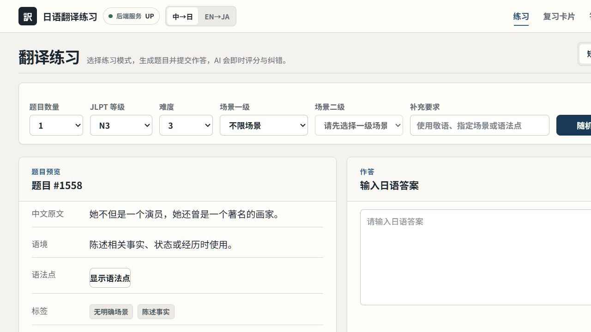
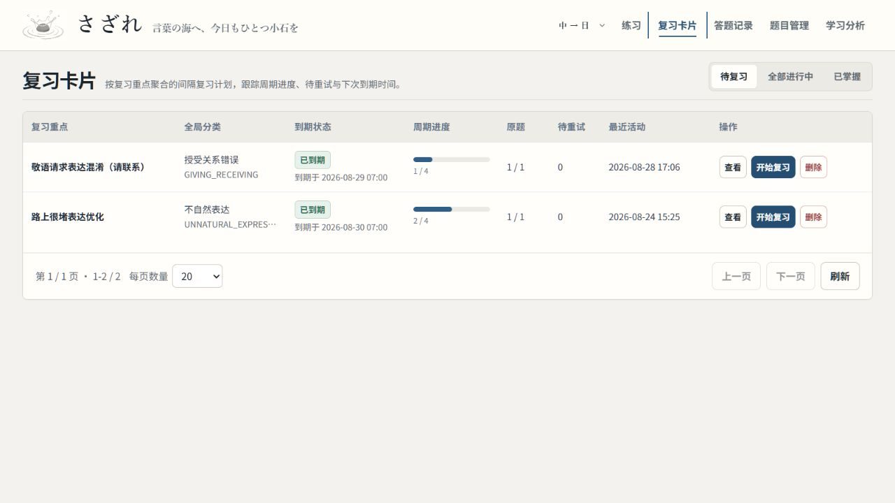
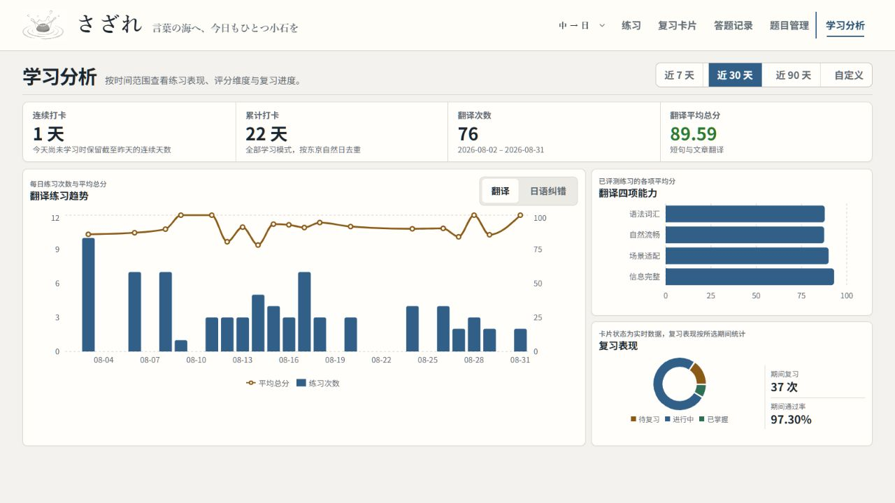
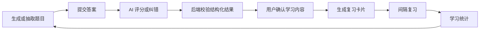

# sazare

> 言葉の海へ、今日もひとつ小石を

一个面向个人本地使用的日语学习项目，覆盖中译日、英译日、文章翻译与纯日语纠错。系统将 AI 题目生成、结构化评分、用户确认、间隔复习和学习统计串联为完整学习闭环。

当前项目以代码质量和工程实践为主要目标，采用单用户模型持续开发，不是面向公网部署的多租户产品。

## 项目界面

### 翻译练习



### 复习卡片



### 学习统计



## 学习闭环



AI 返回内容始终作为候选数据：后端会校验 JSON 结构、字段、枚举、分数和业务关系；错误分析只有在用户主动确认后才会进入复习闭环。

## 核心功能

### 翻译与纠错

- 支持中译日、英译日短句练习，可随机抽题或使用 AI 生成题目。
- 支持中译日、英译日文章练习，包含体裁、长度和 JLPT 语言难度设置。
- 支持纯日语内容纠错，返回完整修订稿、分项评分、错误候选和修改建议。
- 评分结果包含总分、分项评价、错误分析、推荐表达和完整参考答案。

### AI 与题库

- 提供 `mock` 与 Google 两种 AI Provider，通过配置统一切换。
- AI 生成与评分使用固定 JSON 契约，后端负责严格校验和异常处理。
- 使用 PostgreSQL `pgvector` 进行同模型语义相似度检索，减少 AI 生成题目重复。
- 支持短句与文章题目的创建、编辑、启停、逻辑删除、分页筛选和历史向量回填。

### 复习与统计

- 用户可确认 AI 错误候选，也可手动记录需要优化的表达。
- 复习卡片支持复习历史、衍生题生成、逻辑删除和基于 SM-2 的间隔调度。
- 答题记录统一展示短句、文章和纯日语纠错结果。
- 学习统计展示连续与累计打卡、练习趋势、评分维度、卡片状态和复习表现。

### 管理能力

- 管理短句和文章题目，包括分页筛选、创建、编辑、启停和逻辑删除。
- 查询场景、功能和体裁标签，用于题目筛选、AI 生成约束和结果校验。
- 查询分层错误类型与用户已使用的错误类型，保持评分、确认和复习分类一致。

## 技术栈

| 范围 | 技术 |
| --- | --- |
| 后端 | Java 25、Spring Boot 4.0.7、Spring MVC、MyBatis 4.0.1、Maven Wrapper |
| 前端 | React 19、TypeScript 5、Vite 7、Recharts 3、Oxlint |
| 数据 | PostgreSQL 16、pgvector 0.8.6、Redis 7 |
| 本地开发 | Docker Compose、Windows PowerShell |
| AI | Google Gemini API |

## 快速开始

### 环境要求

- Git
- JDK 25
- Node.js `^20.19.0` 或 `>=22.12.0`
- Docker Desktop，并启用 Docker Compose

### 1. 获取代码

```powershell
git clone https://github.com/simokuzure/sazare.git
cd sazare
```

### 2. 启动 PostgreSQL 和 Redis

```powershell
docker compose up -d
docker compose ps
```

默认服务：

| 服务 | 地址 | Compose 服务名 |
| --- | --- | --- |
| PostgreSQL | `localhost:5432` | `postgres` |
| Redis | `localhost:6379` | `redis` |

停止基础服务：

```powershell
docker compose down
```

> `docker compose down -v` 会同时删除 PostgreSQL 和 Redis 数据卷。仅在确定不需要保留本地数据时使用。

### 3. 初始化数据库

首次创建数据库后，在仓库根目录依次执行：

```powershell
Get-Content -Raw -Encoding UTF8 .\backend\src\main\resources\db\schema.sql |
  docker compose exec -T postgres psql -U sazare_user -d sazare

Get-Content -Raw -Encoding UTF8 .\backend\src\main\resources\db\seed.sql |
  docker compose exec -T postgres psql -U sazare_user -d sazare
```

`schema.sql` 是新数据库的完整结构基线，`seed.sql` 写入默认用户、标签和错误类型。已有 PostgreSQL 数据卷不会自动应用后续结构变更。

### 4. 选择 AI Provider

不调用外部 API 的本地调试方式：

```powershell
$env:AI_PROVIDER = "mock"
```

使用 Google AI：

```powershell
$env:AI_PROVIDER = "google"
$env:GOOGLE_AI_API_KEY = "你的 API Key"
```

不要将 API Key 写入代码、配置文件或提交记录。

### 5. 启动后端

在新的 PowerShell 窗口中执行：

```powershell
cd backend
.\mvnw.cmd spring-boot:run
```

- API 基地址：`http://localhost:8080/api`
- 健康检查：`http://localhost:8080/api/health`

### 6. 启动前端

在新的 PowerShell 窗口中执行：

```powershell
cd frontend
npm.cmd install
npm.cmd run dev
```

前端地址为 `http://localhost:5173`。Vite 会将 `/api` 请求代理到 `http://localhost:8080`。

## 环境变量

| 变量 | 默认值 | 是否必需 | 说明 |
| --- | --- | --- | --- |
| `AI_PROVIDER` | `google` | 否 | AI Provider，可选 `mock` 或 `google` |
| `GOOGLE_AI_API_KEY` | 空 | 使用 Google 时必需 | Google AI API Key |
| `GOOGLE_AI_MODEL` | `gemini-3.6-flash` | 否 | 题目生成、评分与纠错模型 |
| `GOOGLE_AI_EMBEDDING_MODEL` | `gemini-embedding-001` | 否 | 题目语义向量模型 |
| `GOOGLE_AI_BASE_URL` | `https://generativelanguage.googleapis.com/v1beta` | 否 | Google AI API 基地址 |
| `GOOGLE_AI_ARTICLE_TEMPERATURE` | `1.1` | 否 | 文章生成 temperature，范围 `0.0`～`2.0` |
| `GOOGLE_AI_ARTICLE_TOP_P` | `0.98` | 否 | 文章生成 topP，范围 `(0.0, 1.0]` |
| `AI_REQUEST_TIMEOUT` | `180s` | 否 | AI 请求超时时间，例如 `240s` |

Redis 只缓存公开且启用的字典数据，默认 TTL 为 24 小时。Redis 或缓存 JSON 异常时，系统会回退到 PostgreSQL；PostgreSQL 始终是业务主数据源。

## 项目结构

```text
sazare/
├─ assets/
│  └─ readme/                  README 页面截图
├─ backend/                    Spring Boot 后端
│  └─ src/main/resources/
│     ├─ db/schema.sql         数据库结构基线
│     ├─ db/seed.sql           默认数据
│     └─ mapper/               MyBatis XML
├─ frontend/                   React 前端
├─ docker-compose.yml          PostgreSQL 与 Redis
└─ README.md                   中文项目说明
```

## 测试与检查

后端测试：

```powershell
cd backend
.\mvnw.cmd test
```

前端静态检查与生产构建：

```powershell
cd frontend
npm.cmd run lint
npm.cmd run build
```
