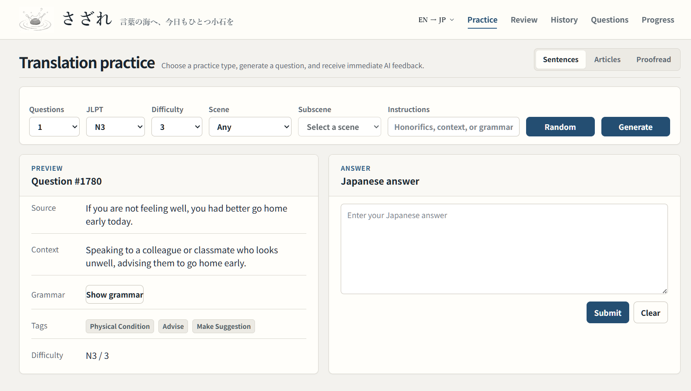
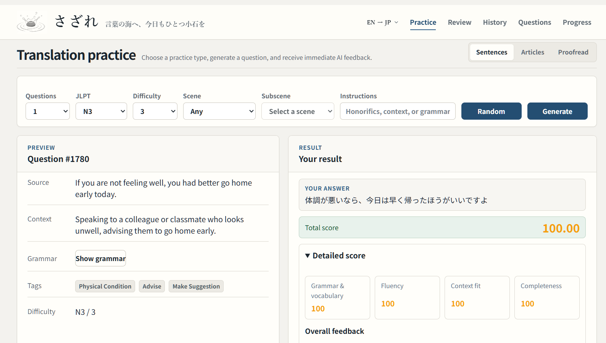
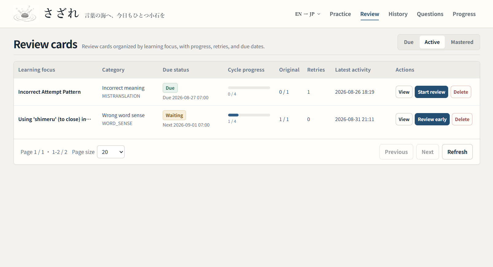
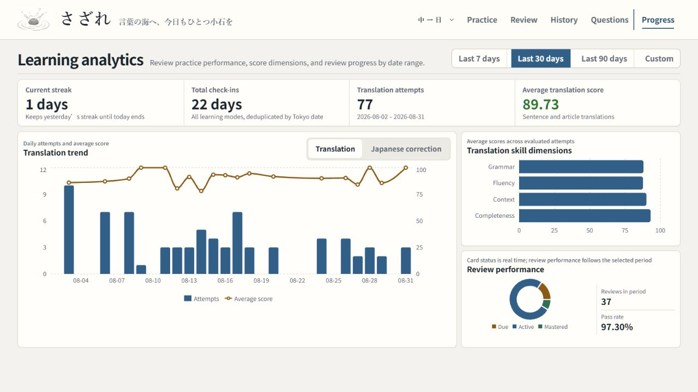
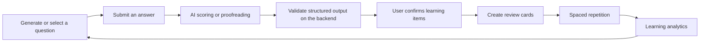

# sazare

[English](README.md) | [简体中文](README.zh-CN.md) | [日本語](README.ja.md)

> 言葉の海へ、今日もひとつ小石を

A Japanese learning application designed for personal use in a local environment. It supports Chinese-to-Japanese and English-to-Japanese sentence and article translation, as well as Japanese proofreading. AI question generation, structured scoring, user confirmation, spaced repetition, and learning analytics form a complete learning loop.

## Interface

### Translation practice



### Scoring results



### Review cards



### Learning analytics



## Learning loop



AI-generated output is always treated as unverified candidate data. Only error analysis explicitly confirmed by the user is added to the review loop.

## Features

### Translation and proofreading

- Practice Chinese-to-Japanese and English-to-Japanese sentence translation with randomly selected or AI-generated questions.
- Practice Chinese-to-Japanese and English-to-Japanese article translation with configurable genre, length, and JLPT level.
- Receive a fully revised version of Japanese text together with dimension scores, candidate errors, and revision suggestions.
- Scoring results include a total score, dimension-level feedback, error analysis, recommended expressions, and full reference answers.

### AI and question bank

- Switch between `mock` and Google AI providers through a unified configuration.
- Use fixed JSON contracts for AI generation and scoring, with strict backend validation and error handling.
- Use PostgreSQL `pgvector` to compare semantic similarity between vectors produced by the same embedding model, reducing duplicate AI-generated questions.
- Create, edit, enable, disable, soft-delete, paginate, and filter sentence and article questions.

### Review and analytics

- Review and confirm potential errors identified by AI, or manually save expressions that need improvement.
- Review cards support review history, derived-question generation, soft deletion, and SM-2-based spaced-repetition scheduling.
- View sentence, article, and Japanese proofreading results in a unified answer history.
- Track the current streak, total study days, practice trends, score dimensions, card status, and review performance.

## Tech stack

| Area | Technologies |
| --- | --- |
| Backend | Java 25, Spring Boot 4.0.7, Spring MVC, MyBatis 4.0.1, Maven Wrapper |
| Frontend | React 19, TypeScript 5, Vite 7, Recharts 3, Oxlint |
| Data | PostgreSQL 16, pgvector 0.8.6, Redis 7 |
| Local development | Docker Compose, Windows PowerShell |
| AI | Google Gemini API |

## Project structure

```text
sazare/
├─ assets/
│  └─ readme/                  README screenshot assets
│     └─ en/                   English UI screenshots
├─ backend/                    Spring Boot backend
│  └─ src/main/resources/
│     ├─ db/schema.sql         Database schema baseline
│     ├─ db/seed.sql           Default data
│     └─ mapper/               MyBatis XML files
├─ frontend/                   React frontend
├─ docker-compose.yml          PostgreSQL and Redis
├─ README.md                   English documentation (default)
├─ README.zh-CN.md             Simplified Chinese documentation
└─ README.ja.md                Japanese documentation
```

## Quick start

### Requirements

- Git
- JDK 25
- Node.js `^20.19.0` or `>=22.12.0`
- Docker Desktop with Docker Compose enabled

### 1. Clone the repository

```powershell
git clone https://github.com/simokuzure/sazare.git
```

### 2. Start PostgreSQL and Redis

```powershell
docker compose up -d
docker compose ps
```

Default services:

| Service | Address | Compose service name |
| --- | --- | --- |
| PostgreSQL | `localhost:5432` | `postgres` |
| Redis | `localhost:6379` | `redis` |

Stop the services:

```powershell
docker compose down
```

### 3. Initialize the database

When initializing a new database, run the following commands from the repository root in order:

```powershell
Get-Content -Raw -Encoding UTF8 .\backend\src\main\resources\db\schema.sql |
  docker compose exec -T postgres psql -U sazare_user -d sazare

Get-Content -Raw -Encoding UTF8 .\backend\src\main\resources\db\seed.sql |
  docker compose exec -T postgres psql -U sazare_user -d sazare
```

`schema.sql` defines the complete schema for a new database. `seed.sql` inserts the default user, tags, and error types.

### 4. Select an AI provider

To use Google AI:

```powershell
$env:AI_PROVIDER = "google"
$env:GOOGLE_AI_API_KEY = "your API key"
```

### 5. Start the backend

In a new PowerShell window, run:

```powershell
cd backend
.\mvnw.cmd spring-boot:run
```

- API base URL: `http://localhost:8080/api`
- Health check: `http://localhost:8080/api/health`

### 6. Start the frontend

In a new PowerShell window, run:

```powershell
cd frontend
npm.cmd install
npm.cmd run dev
```

The frontend is available at `http://localhost:5173`. Vite proxies `/api` requests to `http://localhost:8080`.
